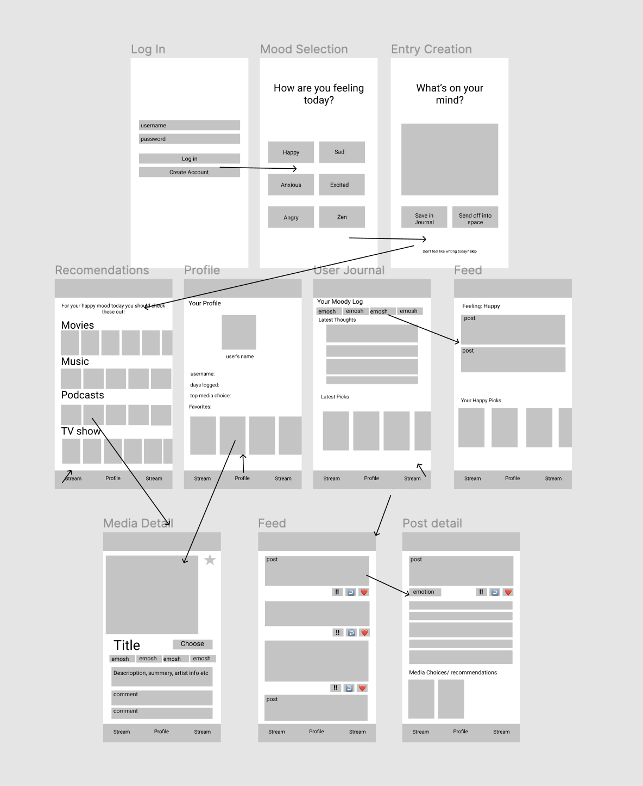

Original App Design Project - README Template
===

# Mood

## Table of Contents
1. [Overview](#Overview)
1. [Product Spec](#Product-Spec)
1. [Wireframes](#Wireframes)

## Overview
### Description
App that checks in on user's mental health and suggests movies, podcasts, and musics for them.

### App Evaluation
[Evaluation of your app across the following attributes]
- **Category:** Entertainment/mental check-in
- **Mobile:** Suggests media(playlists, movies, tv shows, podcasts, etc) for different mental states
- **Story:** Authenticate (keep track of moods, etc.), check user’s current accounts (Netflix/HBO/etc.), question card for mood for how the user feels and stores it, categories (movie/show/etc), leveraging libraries to get the different genres/moods, providing user with options based on parsed genres
- **Market:** Everyone
- **Habit:** Mental check-in provides user with value that will keep them coming back (maybe using visual displays) / natural habitual users
- **Scope:** Started off as mental wellness but can expand to entertainment, and social networking for users by keeping track of moods in some sort of diary or a social aspect to see what friends are watching.

## Product Spec

### 1. User Stories (Required and Optional)

**Required Must-have Stories**

* User can register a new account, login, and logout of account
* User can select an option corresponding to the emotion they are experiencing
* User can scroll through selections of different suggested media
* User can view personal entries posted privately.
* User can view media titles they have selected in the past

**Optional Nice-to-have Stories**

* User can search media titles and view emotion corresponding to it
* User can share entries anonymously
* User can see where to find suggested media item
* User can favorite and view favorited media titles

### 2. Screen Archetypes

* Login
   * User can login to account
* Register
   * User can register a new account
 * Profile
   * User can view favorited titles
   * User can view account information

 * Stream
   * User can scroll through selections of different suggested media
   * User can select an option corresponding to the emotion they are experiencing
   * User can view personal entries posted privately.
   * User can view medias they have selected in the past
   * User can view log of emotions in display form 
   * User can search media titles and view emotion corresponding to it

 * Detail
     * User can view details of past entries
     * User can view details of selected media items
     * User can see where to find suggested media item
     * User can favorite item

 * Creation
   * User can create an entry/response of how they are feeling
   * User can post privately or delete their entry

### 3. Navigation

**Tab Navigation** (Tab to Screen)

* Profile
* Stream 1: Media library
* Stream 2: Entry and media log

**Flow Navigation** (Screen to Screen)

* Login
   * Creation
* Creation
   * Profile
* Stream
  * Detail

## Wireframes

## Schema

**Models**

Model: User
Property| Type | Description | 
--- | --- | --- |
objectId | String | unique id for user (default field) |
email | String | email address associated with user (default field)|
password | String | password associated with user (default field)|
createdAt | DateTime | date when user's account is created (default field) |
updatedAt | DateTime | date when user's account is last updated (default field) |
daysLogged | Number | number of days user has logged in app

Model: Entry
Property| Type | Description | 
--- | --- | --- |
objectId | String | unique id for user entry (default field) |
author| Pointer to User | entry author |
caption | String | entry caption by author |
createdAt | DateTime | date when post is created (default field) |
updatedAt | DateTime | date when post is last updated (default field) |

**Networking**

* Create
  * (Create/POST) Create a new Entry Object  
* Profile
  * (Read/GET) Query logged in user object
  * (Update/PUT) Update user profile image
* User Log screen
  * (Read/GET) Query all posts where user is author

**Network Requests for Existing APIs**

Spotify API
  * Base URL: https://api.spotify.com/v1
  
HTTP Verb | Endpoint| Description | 
--- | --- | --- |
GET | /artists | returns json array of artist data|

The Movie Database API
  * Base URL: https://www.api.themoviedb.org/3
  
HTTP Verb | Endpoint| Description | 
--- | --- | --- |
GET | /genre/movie/list | Get list of official genres for movies |
GET | /genre/tv/list | Get the list of official genres for TV shows |
GET | /movie/{movie_id}/similar | Get the list of similar movies |
GET | /tv/{tv_id}/similar | Get the list of similar TV shows |
GET | /search/movie | Search for movies |
GET | /search/tv | Search for a TV show |

ListenNotes API
  * Base URL: https://listen-api.listennotes.com/api/v2
  
HTTP Verb | Endpoint| Description | 
--- | --- | --- |
GET | /genres | Get list of podcast genres |
GET | /best_podcasts | Get list of best podcasts by genre

